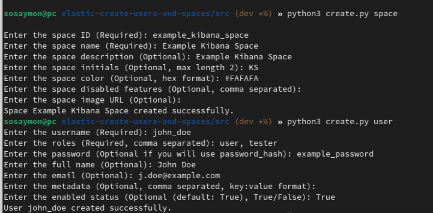

<!-- Project Overview -->

  <h1 align="center">Elastic create users and spaces</h1>

  

    Python script to create Elasticsearch users and Kibana spaces
     
    <a href="https://sosaymon.github.io/elastic-create-users-and-spaces/"><strong>Explore the docs »</strong></a>
     
     
    <a href="https://github.com/SoSaymon/elastic-create-users-and-spaces/issues">Report Bug</a>
    ·
    <a href="https://github.com/SoSaymon/elastic-create-users-and-spaces/issues">Request Feature</a>
  

<!-- Table of Contents -->

  
Table of Contents

  <ol>
    <li>
      <a href="#about-project">About Project</a>
      <ul>
        <li><a href="#getting-started">Getting Started</a></li>
        <ul>
          <li><a href="#local-copy">Local copy</a></li>
            <ul>
              <li><a href="#prerequisites-lc">Prerequisites</a></li>
              <li><a href="#installation-lc">Installation</a></li>
              <li><a href="#configuration-lc">Configuration</a></li>
            </ul>
          <li><a href="#docker">Docker (Work In Progress)</a></li>
            <ul>
              <li><a href="#prerequisites-d">Prerequisites</a></li>
              <li><a href="#installation-d">Installation</a></li>
              <li><a href="#configuration-d">Configuration</a></li>
            </ul>
        </ul>
        <li><a href="#usage">Usage</a>
          <ul>
            <li><a href="#usage-lc">Local copy</a></li>
                <ul>
                  <li><a href="#create-space-lc">Create space</a></li>
                  <li><a href="#create-user-lc">Create user</a></li>
                </ul>
            <li><a href="#usage-d">Docker (Work In Progress)</a></li>
                <ul>
                  <li><a href="#create-space-d">Create space</a></li>
                  <li><a href="#create-user-d">Create user</a></li>
                </ul>
          </ul>
        </li>
      </ul>
    </li>
    <li><a href="#license">License</a></li>
    <li><a href="#contact">Contact</a></li>
  </ol>

<!-- About Project -->
<section>
    

        <h1 id="about-project">About Project</h1>
        
        

        This script is designed to create Elasticsearch users and Kibana spaces. The script is written in Python 3.11 and uses the Elasticsearch and Kibana APIs. The script, thanks to the possibility of loading CSV files, helps to shorten the process of adding users and spaces to a total minimum
        

    

    

        <h2 id="getting-started">Getting Started</h2>
        

            <h3 id="local-copy">Local copy</h3>
            

            To get a local copy up and running follow these simple steps.
            

            <h4 id="prerequisites-lc">Prerequisites</h4>
            <ol>
                <li>Python 3.11</li>
                <li>pip</li>
                <li>Url to your Elasticsearch and Kibana instance and Elastic admin username and password</li>
            </ol>
            <h4 id="installation-lc">Installation</h4>
            <ol>
                <li>
                    Clone the repo
                    <ul>
                        <li>
                            <code>
                                git clone https://github.com/SoSaymon/elastic-create-users-and-spaces.git
                            </code>
                        </li>
                    </ul>
                </li>
                <li>
                    Setup Virtual Environment
                <li>
                    Install Python packages
                    <ul>
                        <li><code>pip install -r requirements.txt</code></li>
                    </ul>
                </li>
            </ol>
            <h4 id="configuration-lc">Configuration</h4>
            <ol>
                <li>Rename file <code>.env_template</code> to <code>.env</code></li>
                <li>Fill in the variables in the <code>.env</code> file</li>
            </ol>
        

        

            <h3 id="docker">Docker</h3>
            
Docker image is not ready yet and is still under development

        

    

    

        <h2 id="usage">Usage</h2>
        

            <h3 id="usage-lc">Local copy</h3>
            

                
To create Kibana space follow these steps

                <ol>
                    <li>
                        Enter this prompt in commandline 
                        <code>python3 create.py space</code>
                    </li>
                    <li>
                        Follow the instructions in the prompt
                    </li>
                </ol>
                
To create Elasticsearch user follow these steps

                <ol>
                    <li>
                        Enter this prompt in commandline 
                        <code>python3 create.py user</code>
                    </li>
                    <li>
                        Follow the instructions in the prompt
                    </li>
                </ol>
            

        

    

    

        <h2 id="license">License</h2>
        

            Distributed under the MIT License. See <a href="LICENSE">`LICENSE`</a> for more information.
        

    

    

        <h2 id="contact">Contact</h2>
        

            If you have any questions about the project, feel free to contact me at <a href="mailto:szymon.chirowski@protonmail.com">szymon.chirowski@protonmail.com</a>. 
            You can find my other projects at <a href="https://github.com/SoSaymon/">My GitHub account</a>.
        

        

            Project Link: <a href="https://github.com/SoSaymon/elastic-create-users-and-spaces/">https://github.com/SoSaymon/elastic-create-users-and-spaces/</a> 
            Author: Szymon Chirowski  
            Documentation: <a href="">LINK</a>
        

    

</section>
